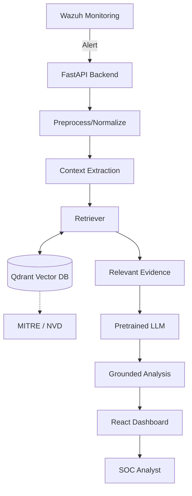

# SOC Assistant

AI-Powered Security Operations Center (SOC) Assistant Using Large Language Models.

## Purpose

This research prototype/web application assists SOC analysts in understanding and investigating security alerts from Wazuh. It uses RAG (Retrieval-Augmented Generation) with MITRE ATT&CK and NVD/CVE databases to provide context-aware LLM analysis of security events.

**Important Note:**
- This is NOT a SIEM.
- This is NOT a replacement for a SOC analyst.
- This is NOT an autonomous security-response system.
- Wazuh acts as the security monitoring/alert source.

## Architecture



## Technology Stack

- **Backend:** Python, FastAPI, SQLAlchemy, PostgreSQL, Alembic
- **Frontend:** React, Vite, TypeScript, Tailwind CSS
- **Infrastructure:** Docker, Docker Compose

## Repository Structure

- `/backend` - FastAPI server, DB models, RAG/LLM placeholder interfaces.
- `/frontend` - React application with modern dark-mode dashboard.
- `/knowledge` - Directory for storing knowledge base files (MITRE, NVD).
- `/scripts` - Utilities for data ingestion and maintenance.

## Local Setup

### 1. Environment Variables

Copy the `.env.example` to `.env` in the backend folder:
```bash
cp backend/.env.example backend/.env
```
Fill in any required values (though mock values are fine for initial development).

### 2. Running with Docker Compose

To start the PostgreSQL database, FastAPI backend, and Vite frontend:
```bash
docker-compose up -d --build
```
- Frontend will be available at: http://localhost:5173
- Backend API will be available at: http://localhost:8000
- API documentation: http://localhost:8000/api/v1/openapi.json

### 3. Running Locally (Without Docker)

**Backend:**
```bash
cd backend
python -m venv venv
source venv/bin/activate  # On Windows: venv\Scripts\activate
pip install -r requirements.txt
alembic upgrade head
uvicorn app.main:app --reload
```

**Frontend:**
```bash
cd frontend
npm install
npm run dev
```

## Current Limitations & Mock Mode

Currently, this application is in **Phase 1: Base Architecture**.
- Wazuh integration is using a **mock client** that returns hardcoded alerts.
- RAG and LLM features are using **placeholder implementations**.
- The dashboard is fully functional but displays the mocked data.

## Future Implementation Phases

1. **Phase 2:** Connect real Wazuh API.
2. **Phase 3:** Set up Qdrant vector database and text embedding models.
3. **Phase 4:** Ingest MITRE ATT&CK and NVD knowledge bases.
4. **Phase 5:** Integrate local or remote LLM for RAG-based analysis.
5. **Phase 6:** Implement evaluation metrics.
